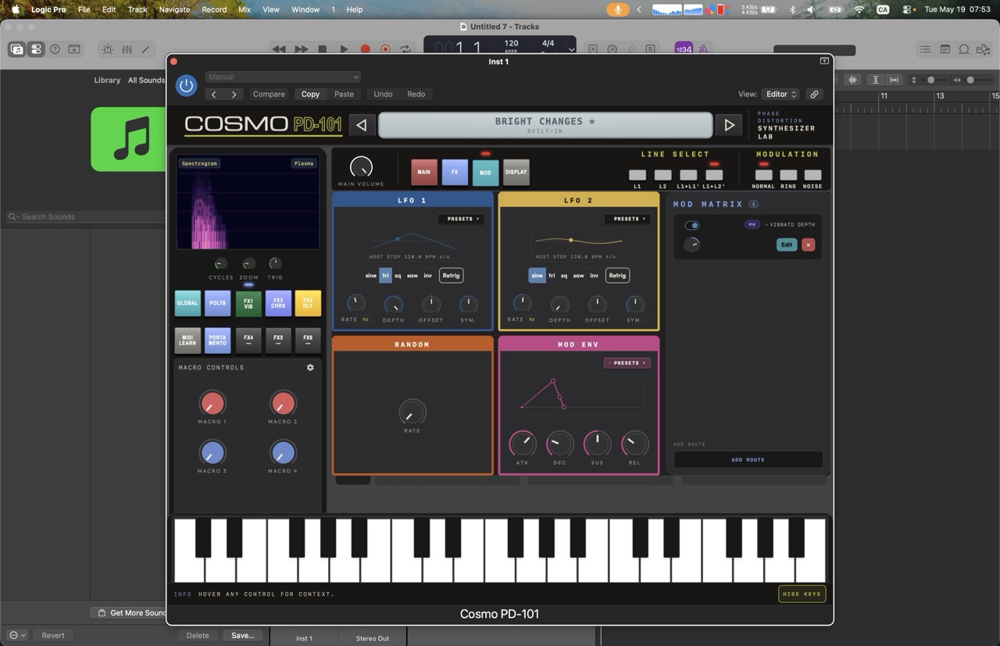

import { Steps } from '@rspress/core/theme';

# DAW Plugin



The **Cosmo PD-101 Plugin** runs as a **VST3**, **CLAP**, or **AUv2** plugin inside your DAW. It uses the native Rust synth engine via the truce framework and an embedded webview for the UI.

## Supported Formats

| Format | Platform | DAW Compatibility |
|--------|----------|-------------------|
| **VST3** | Windows, macOS | Ableton Live, FL Studio, Bitwig, Reaper, Cubase, etc. |
| **CLAP** | Windows, macOS, Linux | Bitwig 5+, Waveform 12+, Reaper 7+ |
| **AUv2** | macOS only | Logic Pro, Ableton Live (macOS), MainStage |

## Installation


:::warning
Plugin builds are currently unsigned, so macOS may block the plugin from loading. To bypass Gatekeeper:

1. Open **System Settings → Privacy & Security**.
2. Scroll to the **Security** section and ensure **App Store and identified developers** is selected.
3. Open **Terminal** and run:

```bash
sudo xattr -dr com.apple.quarantine ~/Library/Audio/Plug-Ins/VST3/CosmoPD-101.vst3
sudo xattr -dr com.apple.quarantine ~/Library/Audio/Plug-Ins/Components/CosmoPD-101.component
sudo xattr -dr com.apple.quarantine ~/Library/Audio/Plug-Ins/CLAP/CosmoPD-101.clap
```

Enter your password when prompted.

Replace `~/Library/Audio/Plug-Ins/` with the actual installation path if you installed the plugins elsewhere. You only need to run the command for the formats you use.
:::

<Steps>

### Download

Download the latest plugin package from the [Purr Audio store](https://store.purraudio.dev/) or clone the repo and [build from source](/contributing/).

### Install

Copy the plugin file to your DAW's plugin directory.

### Rescan

Rescan your DAW's plugin list to discover the Cosmo PD-101.

</Steps>


## Using the Plugin

1. Create a MIDI track in your DAW.
2. Insert **Cosmo PD-101** as an instrument plugin.
3. Arm the track for MIDI input.
4. Play!

### Presets in the Plugin

- **Factory presets** are pre-loaded.
- **User presets** are saved via the preset browser and stored in the DAW's plugin data directory.

Previous: [Web App](/getting-started/web-app) | Next: [Synth Overview](/synth-reference/overview)
