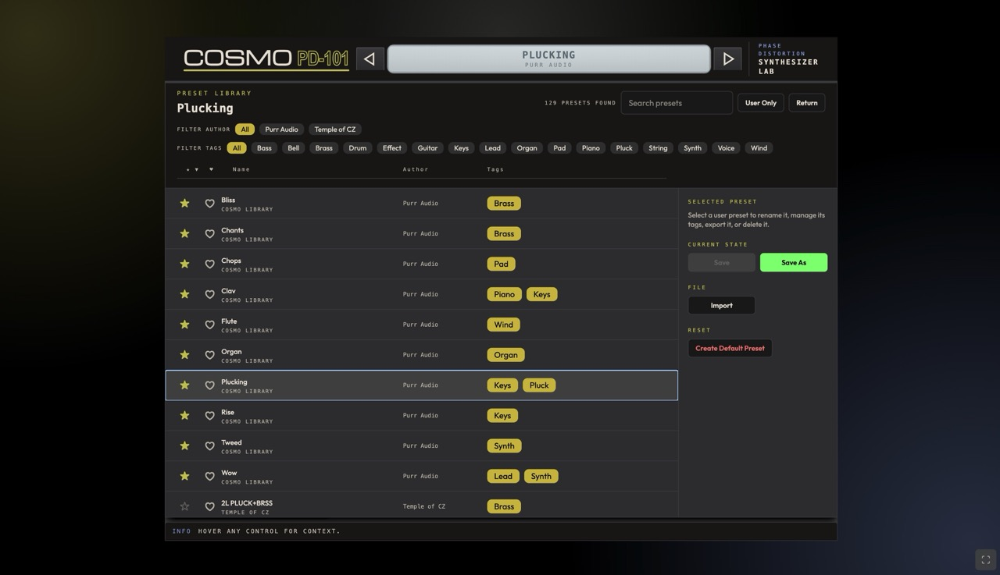

# Managing Presets

## Where Presets Live

IndexedDB (web app) or local presets directory (desktop/plugin). Exportable as JSON.

## Loading a Preset

1. Click preset icon -> open library.
2. Browse/search by name.
3. Click a preset to load.

## Saving a Preset

1. Adjust controls. 2. Click "Save preset". 3. Enter name. 4. Optionally set author and tags.

## Preset File Format

Versioned JSON schema (v1) with params for lineSelect, modMode, octave, volume, polyMode, portamento, line1, line2, modMatrix, fxSlots.

## Importing/Exporting

Export as `.json`, import `.json` files. Portability across all platforms (Web, Desktop, Plugin).

## Importing Casio CZ-101 SysEx

See [SysEx Import/Export](/presets/sysex).

## Organizing Presets

:::tip
Use search, categories, tags, and favorites (star) to keep your preset library organized as it grows.
:::

## Factory Presets

Categories: Lead, Bass, Pad, FX.

Next: [SysEx Import/Export](/presets/sysex) | Previous: [Effects](/synth-reference/effects)
