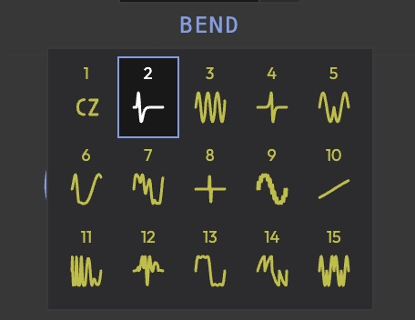

import { Badge } from '@rspress/core/theme';

# Algorithms

15 phase distortion algorithms: 1 CZ-101 legacy + 14 original Cosmo warp algorithms.

:::info
The CZ-101 legacy algorithms are provided for compatibility with Casio CZ-101 SysEx imports. The Cosmo original algorithms extend far beyond what the original hardware could do.
:::

## CZ-101 Legacy

- **CZ Saw** <Badge text="Legacy" type="tip" /> -- Classic bright sawtooth. Waveform 1/2 options, Window control.
- **CZ Square** <Badge text="Legacy" type="tip" /> -- Hollow, reedy square wave.
- **CZ Pulse** <Badge text="Legacy" type="tip" /> -- Narrower than saw, buzzy. Brass-like.
- **CZ Double Sine** <Badge text="Legacy" type="tip" /> -- Soft, rounded. Two sine-like components.
- **CZ Saw Pulse** <Badge text="Legacy" type="tip" /> -- Saw brightness with pulse-width character.
- **CZ Reso 1-3** <Badge text="Legacy" type="tip" /> -- Resonant, metallic tones with window function.

## Cosmo Original Warp Algorithms

### Bend <Badge text="New" type="info" />
Parameters: Bend Curve, Bend Bias, Bend Knee. Pitch-dependent timbral shift, expressive vocal-like tones.

### Sync <Badge text="New" type="info" />
Parameters: Sync Ratio, Sync Phase, Sync Curve, Sync Window. Hard-sync style, metallic screaming leads.

### Pinch <Badge text="New" type="info" />
Parameters: Pinch Focus, Pinch Asym, Pinch Curve, Pinch Drive. Squeezed nasal tones to aggressive distortion.

### Fold <Badge text="New" type="info" />
Parameters: Fold Stages, Fold Tilt, Fold Symmetry, Fold Softness. Wavefolder -- subtle to chaotic.

### Skew <Badge text="New" type="info" />
Parameters: Skew Bias, Skew Curve, Skew Spread, Skew Tilt. Asymmetric waveforms, evolving pads.

### Twist <Badge text="New" type="info" />
Parameters: Twist Harmonics, Twist Depth, Twist Phase, Twist Shape. Spiraling vortex-like timbres.

### Clip <Badge text="New" type="info" />
Parameters: Clip Drive, Clip Shape, Clip Bias, Clip Soft. Warm saturation to hard digital clipping.

### Ripple <Badge text="New" type="info" />
Parameters: Ripple Freq, Ripple Depth, Ripple Phase, Ripple Shape. Undulating watery textures.

### Mirror <Badge text="New" type="info" />
Parameters: Mirror Center, Mirror Blend, Mirror Clip, Mirror Skew. Metallic bell-like tones.

### Karpunk <Badge text="New" type="info" />
Parameters: Karpunk Damp, Karpunk Bright, Karpunk Decay, Karpunk Excite. Noisy karplus-strong-like pluck.

### FOF (Formant) <Badge text="New" type="info" />
Parameters: FOF Ratio, FOF Tightness, FOF Offset, FOF Skew. Vocal/formant-like vowel timbres.

### Terrain <Badge text="New" type="info" />
Parameters: Terrain Ratio, Terrain Depth, Terrain FM Phase, Terrain Shape. Organic landscape-inspired timbres.

### Stutter <Badge text="New" type="info" />
Parameters: Stutter Segs, Stutter Reverse, Stutter Slip, Stutter Spacing. Granular stutter/glitch textures.

### Cheby (Chebyshev) <Badge text="New" type="info" />
Parameters: Cheby Order, Cheby Tilt, Cheby Warp. Polynomial-based distortion, clean to complex.

Next: [Envelopes](/synth-reference/envelopes) | Previous: [Oscillators](/synth-reference/oscillators)
