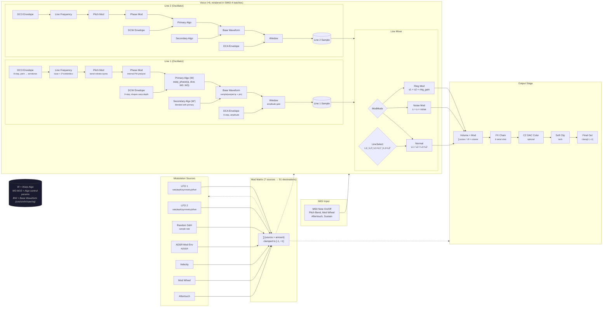
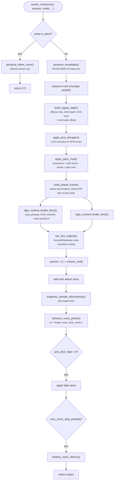
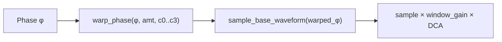
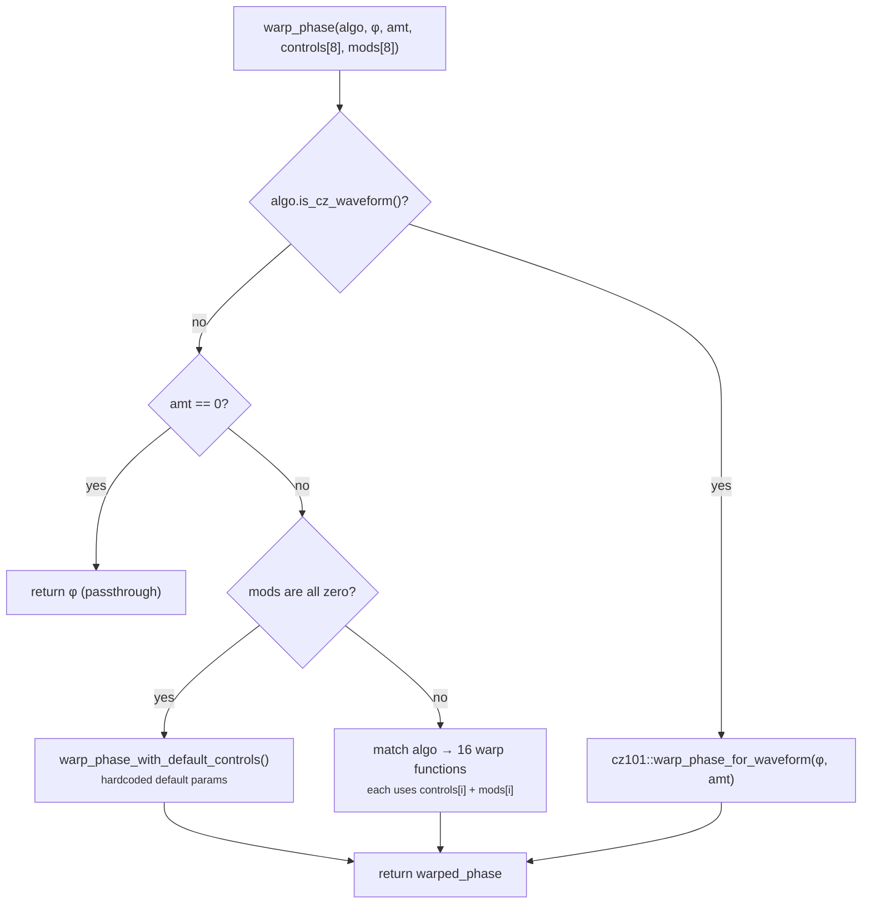
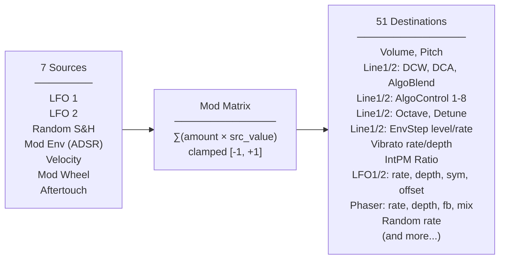
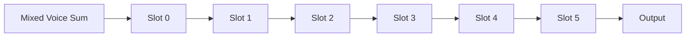

# Cosmo PD-101 Synth Engine

A phase distortion (PD) synthesiser DSP core written in Rust. Compiles to native (Tauri desktop, VST3/AU) and WebAssembly (AudioWorklet).

---

## Architecture Overview

```
┌─────────────────────────────────────────────────────────────────┐
│                     CosmoProcessor                               │
│  ┌──────────┐  ┌──────────────────────────────────────────┐     │
│  │ MIDI In  │  │              Process Loop                │     │
│  │ Note On  │  │  ┌──────┐ ┌──────────┐ ┌─────────────┐  │     │
│  │ Note Off │──▶│  │ LFO1 │ │  Voice   │ │    FX       │  │     │
│  │ PitchBend│  │  │ LFO2 │ │  x8 (4   │ │  Chain 6    │──▶───▶──Out
│  │ ModWheel │  │  │ Rand │ │ SIMD)    │ │  Slots      │  │     │
│  │ Sustain  │  │  └──────┘ └──────────┘ └─────────────┘  │     │
│  └──────────┘  │  ┌──────────┐                           │     │
│                │  │ Mod      │←── Mod Matrix (7→51)      │     │
│                │  │ Sources  │                           │     │
│                │  └──────────┘                           │     │
│                └──────────────────────────────────────────┘     │
└─────────────────────────────────────────────────────────────────┘
```

---

## Audio Graph — Sample-by-Sample Signal Flow



---

## Per-Voice Render Pipeline



---

## Phase Distortion Algorithms

Each oscillator line runs a **phase distortion algorithm**: a warp function transforms the input phase `φ` before sampling a base waveform. The DCW (Digital Controlled Waveshape) envelope controls warp depth.

### CZ-101 Legacy Waveforms

These emulate the original Casio CZ-101 phase distortion directly:

| Algo | Original CZ Name | Description |
|------|------------------|-------------|
| `Cz101` | (generic) | Variable distortion curve |
| `Saw` | Saw | PD sawtooth |
| `Square` | Square | PD square wave |
| `Pulse` | Pulse | PD pulse wave |
| `Null` | Null | Silence/gate |
| `SinePulse` | Sine + Pulse | Cross-faded sine/pulse |
| `SawPulse` | Saw + Pulse | Cross-faded saw/pulse |
| `MultiSine` | Multi Sine | Layered sine PD |
| `Pulse2` | Pulse 2 | Alternative pulse PD |

### Warp Algorithms (Cosmo-Original)

These go beyond the CZ-101 with custom phase-warping functions. Each has up to 4 control parameters:



| Algo | Controls | Description |
|------|----------|-------------|
| `Bend` | curve, bias, knee | Smooth phase bending |
| `Sync` | ratio, phase_offset, curve, window | Hard-sync style phase reset |
| `Pinch` | focus, asym, curve, drive | Squeeze/stretch phase regions |
| `Fold` | stages, tilt, symmetry, softness | Wavefolding via phase inversion |
| `Skew` | bias, curve, spread, tilt | Asymmetric phase stretching |
| `Twist` | harmonics, depth, phase_offset, shape | Harmonic twisting |
| `Clip` | drive, shape, bias, soft | Phase clipping/wrapping |
| `Ripple` | freq, depth, phase_offset, shape | Ripple modulation filter |
| `Mirror` | center, blend, clip, skew | Phase mirroring |
| `Fof` | ratio, tightness, offset, skew | Formant (Fof) synthesis |
| `Sine` | (none) | Pure sine (amt→amp) |
| `Terrain` | x, y, z, scale | 3D terrain lookup noise |
| `Cheby` | order, mix, —, — | Chebyshev polynomials |
| `Stutter` | rate, depth, —, — | Granular stutter |

> **Dual-algo blending**: Each line can blend two algorithms (`algo` + `algo2`) via `algo_blend [0..1]`. When both are set, DCW depth is partitioned: `primary_dcw = dcw × (1-blend)`, `secondary_dcw = dcw × blend`.

### How warp_phase works



---

## Envelopes

### 8-Step CZ-Style Envelope (DCO / DCW / DCA)

Each oscillator line has 3 independent 8-step envelope generators — one per DCO, DCW, DCA:

```
Step: [0]──→[1]──→[2]──→[3]──→[4]──→[5]──→[6]──→[7]
       ↑     ↑     ↑     ↑
       │     │     │     └── sustain step (hold until note-off)
       │     │     └──────── optional loop-back
       │     └──────────────
       └──────────────────── rate(0..99) × level distance
```

Key behaviour:
- Each step defines: `rate (0-99)`, `level (0-127 raw / 0-99 human)`
- Step duration = `rate_to_seconds(rate) × |target_level - prev_level|`
- Sustain step holds until note-off, then release steps continue
- Optional loop mode repeats from step 0
- Rate curves differ per envelope kind: DCO (235s→4ms), DCA/DCW (104s→4ms)

### ADSR Mod Envelope

A simpler 4-stage envelope used as a modulation source (routes to any destination via mod matrix):
Attack → Decay → Sustain → Release

### Envelope Timing Curves (measured from original CZ-101)

```
DCO:   t(rate) = 235.64 × exp(-13.984 × rate/99)
DCA:   t(rate) = 104.04 × (0.004/104.04)^(rate/99)
DCW:   (same as DCA)
```

---

## Modulation Matrix



Each route: `source × amount → destination`, summed per destination and clamped. The mod matrix is pre-cached per sample frame (`ModMatrixCache`) for O(1) per-destination lookups during voice rendering.

### Modulation Sources

| Source | Range | Description |
|--------|-------|-------------|
| LFO 1 | [-1, +1] | Multi-waveform, 0.01-40 Hz, symmetry control |
| LFO 2 | [-1, +1] | Independent LFO, same feature set |
| Random | [-1, +1] | Sample-and-hold, 0-200 Hz rate |
| Mod Env | [0, +1] | ADSR envelope triggered by note-on |
| Velocity | [0, +1] | Note-on velocity |
| Mod Wheel | [0, +1] | MIDI CC 1 |
| Aftertouch | [0, +1] | Channel pressure |

> Envelope step modulation (rate/level per step) is supported as a special case — if any routes target env step destinations, full envelope data is cloned and mutated per-sample to reflect live mod.

---

## FX Chain



6 serial FX slots. Empty/Vibrato/PhaseMod slots pass through (those operate at voice level). The 17 effect types:

| FX | Type | Key Parameters |
|----|------|----------------|
| **Chorus** | time-based | rate, depth, mix |
| **Delay** | time-based | time, feedback, mix, tape_mode, warmth |
| **Reverb (FDN)** | spatial | mix, space, predelay, distance, character |
| **Phaser** | modulation | rate, depth, mix, feedback |
| **Compressor** | dynamics | threshold, ratio, attack, release, makeup, mix |
| **5-Band EQ** | filter | gain80, gain240, gain750, gain2200, gain8000 |
| **Grain Delay** | granular | time, feedback, scatter, density, mix |
| **Bitcrusher** | lo-fi | bits, rate_reduction, mix |
| **ShimmerVerb** | spatial | shimmer, space, mix |
| **Distortion** | waveshape | mode, drive, tone, mix |
| **Juno Chorus** | modulation | mode (I/II), mix |
| **Ring Mod** | modulation | carrier_hz, mix |
| **Tremolo** | modulation | rate, depth, waveform, mix |
| **Wavefolder** | waveshape | drive, folds, mix |
| **LoFi** | lo-fi | degrade, wow/flutter, tone, mix |
| **Vibrato** | pitch | waveform, rate, depth, delay (voice-level) |
| **PhaseMod** | pitch | amount, ratio, pre/post (voice-level) |

---

## Voice Architecture (8 Voices)

- `NUM_VOICES = 8` polyphonic voices
- Rendered in SIMD-4 batches for efficiency
- Auto-detects SIMD backend: AVX2 (x86), SSE2 (x86 fallback), WASM SIMD, or scalar fallback
- Voice lifecycle: note-on → attack → decay → sustain → note-off → release → fade → zero-cross stop → silence
- Anti-click: 64-sample attack ramp, release fade (1/2 cycle length, up to 1024 samples), zero-cross detection for click-free note-off
- Portamento: Rate mode (exponential glide) or Time mode (linear, fixed duration)
- Line select modes: L1-only, L2-only, L1+L1' (L1 rendered twice with different phase), L1+L2' (L1 + L2 rendered through L1 params)

### Line Mixing Modes

| Mode | Formula | Description |
|------|---------|-------------|
| `Normal` | s1 + s2 (or L1/L2 solo) | Standard additive mix |
| `Ring` | s1 × s2 × ring_gain | Ring modulation |
| `Noise` | mix + mix × noise × 0.5 | Amplitude noise modulation |

### CZ DAC Color (optional)

Disabled by default. Models the non-linear transfer function of the original Casio CZ-101 DAC for authentic lo-fi character.

---

## Parameter Hierarchy

```
SynthParams
├── line1: LineParams
│   ├── algo: Algo (primary phase distortion algorithm)
│   ├── algo2: Option<Algo> (secondary blend)
│   ├── algo_blend: f32 [0..1]
│   ├── base_waveform_a/b: BaseWaveform
│   ├── window: WindowType
│   ├── dca_base / dcw_base: f32
│   ├── octave / detune_note / detune_fine: f32
│   ├── dco_env / dcw_env / dca_env: StepEnvData (8-step)
│   ├── dcw_key_follow: f32
│   ├── dca_key_follow: f32
│   └── algo_controls_a/b: Vec<AlgoControlValueV1>
├── line2: LineParams (same structure as line1)
├── lfo / lfo2: LfoParams
├── mod_matrix: ModMatrix (routes Vec<ModRoute>)
├── mod_env: ModEnvParams (ADSR)
├── random: RandomParams
├── fx_slots: [FxSlotConfig; 6]
├── volume, octave, ring_gain: f32
├── poly_mode: PolyMode | Mono
├── portamento: PortamentoParams
├── pitch_bend_range: f32
└── velocity_curve: f32
```

---

## Build Targets

| Target | Crate Feature | Platform |
|--------|--------------|----------|
| Native (Tauri) | `std` | macOS, Windows, Linux |
| VST3/AU plugin | `std` | DAW host (via truce) |
| WASM AudioWorklet | `wasm` | Browser (via wasm-bindgen) |
| no_std | (none) | Embedded (future) |
